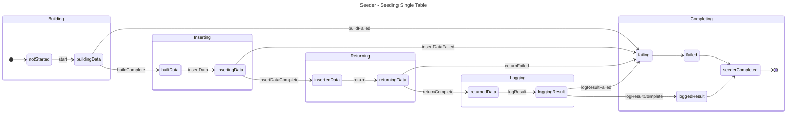

# seederStateDiagram

```mermaid
---
title: Seeder - Seeding Single Table
---
stateDiagram-v2
    direction LR

    state Building {
        [*] --> notStarted
        notStarted --> buildingData: start
        buildingData --> builtData: buildComplete
        buildingData --> failing: buildFailed
    }

    state Inserting {
        builtData --> insertingData: insertData
        insertingData --> insertedData: insertDataComplete
        insertingData --> failing: insertDataFailed
    }

    state Returning {
        insertedData --> returningData: return
        returningData --> returnedData: returnComplete
        returningData --> failing: returnFailed
    }

    state Logging {
        returnedData --> loggingResult: logResult
        loggingResult --> loggedResult: logResultComplete
        loggingResult --> failing: logResultFailed
    }

    state Completing {
        direction LR
        failing --> failed
        failed --> seederCompleted
        loggedResult --> seederCompleted
        seederCompleted --> [*]
    }
```
